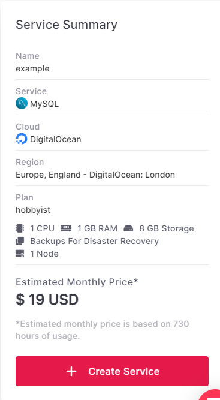

# Sequelize ORM: what, why (and why not) - with bonus Aiven!

This article introduces [Sequelize ORM](https://sequelize.org/). We'll take a look at the pros and cons of ORMs (object-relational mappings), before examining a couple of Sequelize examples that demonstrate some of its benefits. The post is accompanied by a simple Node app, designed to work with an Aiven MySQL service, allowing you to run the examples if you wish. The code is [available on GitHub](https://github.com/StarfallProjects/sequelize-aiven-demo).

Sequelize is a Node.js ORM. From the Sequelize ORM website:

> Sequelize is a promise-based Node.js ORM for Postgres, MySQL, MariaDB, SQLite and Microsoft SQL Server. It features solid transaction support, relations, eager and lazy loading, read replication and more. ([source](https://sequelize.org/))

It is open sourced under the MIT license, and actively developed. You can view the project on [GitHub - Sequelize](https://github.com/sequelize/sequelize/).

## What is an ORM, why you might want to use one - and why you might not

An object-relational mapping provides, in basic terms, an object-oriented way of interacting with relational databases. Wikipedia offer a useful summary of the core problem they aim to solve:

> The heart of the problem involves translating the logical representation of the objects into an atomized form that is capable of being stored in the database while preserving the properties of the objects and their relationships so that they can be reloaded as objects when needed. ([source](https://en.wikipedia.org/wiki/Object%E2%80%93relational_mapping)).

ORMs offer several benefits:

* A standardized and reusable language: write your code once, using an ORM, and you can run it against multiple databases. An ORM (object-relational mapping) smoothes over SQL vendor differences by providing a standardized query language. The same code can be run against MySQL, PostgresSQL, SQLite, and so on. 
* Models (objects representing data) are write-once, use everywhere, making for good DRY (don't repeat yourself) practices.
* It's an additional layer of abstraction, meaning you can work with the database without understanding its underlying architecture (in theory).
* There can be security benefits: SQL injection is generally harder, as queries are prepared and sanitized.
* They can improve developer productivity: for more complex SQL queries, the ORM version may be simpler to write.

However, ORMs also have their drawbacks:

* More complex queries can result in bad performance.
* The additional layer of abstraction can be a hinderance as well as a help: it can mean you don't understand what's really going on with the database, making troubleshooting harder. 
* The abstraction only goes so far: you'll still need a basic understanding of data types and database features to write usable models.

Now let's take a look at Sequelize in action.

## Run the examples

This section guides you through setting up an Aiven MySQL service and running the example queries. If you don't care about running the examples, skip ahead to [Understand the basics](#understand-the-basics).

You'll need:

* [Node.js](https://nodejs.org/en/) installed on your machine. This tutorial was developed using Node v16.13.0.
* An [Aiven](https://aiven.io/) account.
* git

### Set up a MySQL database

For these examples, we'll create a hobbyist-tier MySQL database on DigitalOcean. For production use, you probably want a higher tier plan, but hobbyist is great for testing things out. Read more in our [plan comparison](https://aiven.io/mysql#pricing).

1. Log in to your Aiven console.
2. Select **Create Service**.
3. Choose the following options:
    * Service: MySQL
    * Cloud provider: Digital Ocean
    * Cloud region: choose one near you!
    * Service plan: Hobbyist
4. Enter a name for this service.  
    Your final configuration should look like this:
    
5. Select **+ Create Service**. Aiven will set up your database. This may take a few minutes.


### Run the app

Scaffold your project:

```
git clone https://github.com/StarfallProjects/sequelize-aiven-demo.git
cd sequelize-aiven-demo
npm install
```

Create a `.env` file, and add the following:

```
AIVEN_MYSQL_URI=<Service URI>
```

You can get your service URI from the Aiven console, in the service **Overview** page.

Now run the examples with `npm start`. The first time they run, they'll create a table, `Books`, in your database, and add three rows. On future runs, this step is skipped.

## Understand the basics

There are a few basic things you need to do to work with Sequelize:

* Load your dependencies (just like any Node app)
* Create a database connection with `new Sequelize`
* Create a model. In our example, we're using a simplified model of a book, with primary key, title, and author.

```js
// index.js
require('dotenv').config()
const { Sequelize, DataTypes } = require('sequelize');

// Create the connection by passing a connection URI
const sequelize = new Sequelize(process.env.AIVEN_MYSQL_URI)

// define the 'Book' model
const Book = sequelize.define('Book', {
    id: {
        type: DataTypes.INTEGER,
        primaryKey: true,
        autoIncrement: true
    },
    title: {
        type: DataTypes.STRING,
        allowNull: false
    },
    authorName: {
        type: DataTypes.STRING,
        allowNull: false
    }
});
```

## Example 1: Use Sequelize ORM to add data

You can use Sequelize to set up your database from scratch. Once you have a model, running `sync()` will create a table. You can then populate this table with data. This can be particularly useful if you need to create and destroy test environments regularly.

Helpfully, `sync()` only runs if needed - so if a 'Books' table already existis, it won't overwrite it. For more information, refer to [Sequelize - Model synchronization](https://sequelize.org/master/manual/model-basics.html#model-synchronization).

```js
// Create the 'Books' table and add some data
async function createBooksTable() {
    let res = await Book.sync();
    if(Book.count !=0) {
        console.log("Database has rows already!")
    } else {
        console.log("Adding some rows . . .");
        res.bulkCreate([
            {title: "Carpe Jugulum", authorName: "Terry Pratchett"},
            {title: "Hold Your Own", authorName: "Kae Tempest"},
            {title: "Neuromancer", authorName: "William Gibson"}
        ]);
    }  
}
createBooksTable();
```

## Example 2: SELECT

Let's do the most basic of operations: `SELECT * FROM Books`.

```js
async function getAllBooks() {
    const books = await Book.findAll();
    console.log("All book:", JSON.stringify(books, null, 2));
}
```

Already, `Book.findAll()` is _slightly_ more elegant than `SELECT * FROM Books`. It is also more familiar syntax to JavaScript developers! This familiarity is perhaps the biggest benefit, especially on simple queries where neither the JavaScript nor the SQL is particularly complex to write.

Compare this Sequelize query to get all books where the author name includes 'ratch':

```js
await Book.findAll({
    where: {
        authorName: {
            [Op.like]: '%ratch%'
        }
    }
});
```

With the SQL query: `SELECT * FROM Books WHERE authorName LIKE '%ratch%'`.

Neither is especially complex, both are readable. But the Sequelize version follows a pattern that is already familiar to JavaScript developers, and may cause a little less friction when coding.